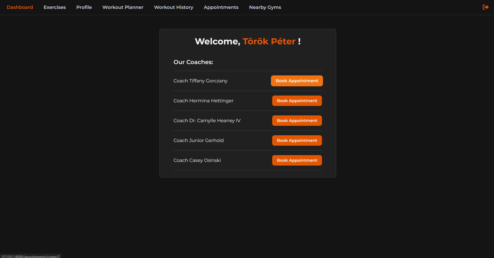
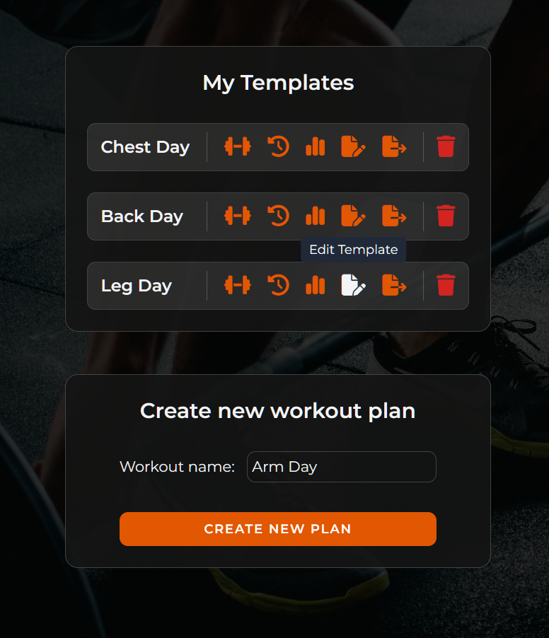
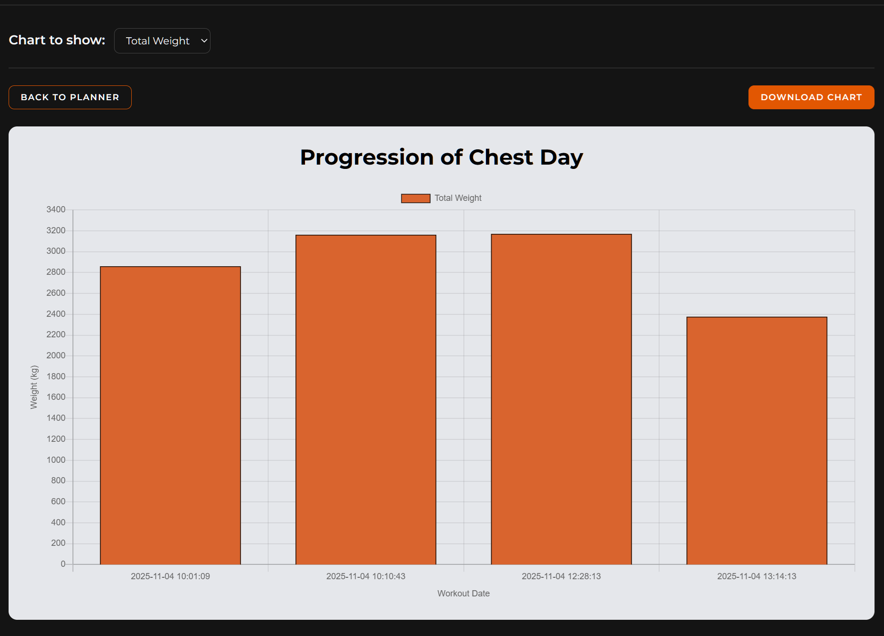
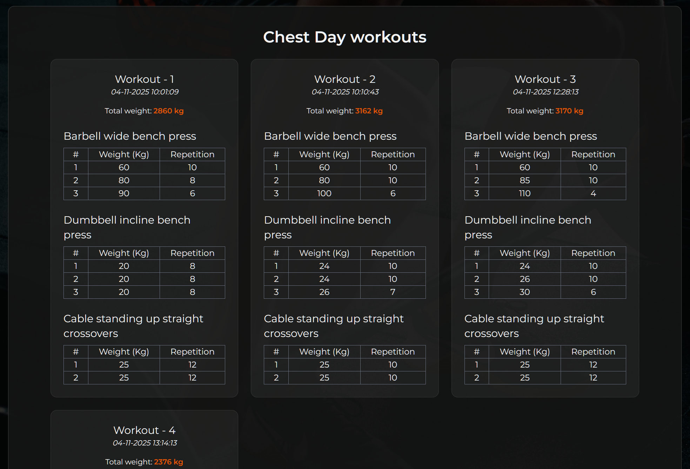

<!-- README TOP -->
<div id="readme-top"></div>

[![Contributors][contributors-shield]][contributors-url]
[![Stargazers][stars-shield]][stars-url]
[![Issues][issues-shield]][issues-url]
[![LinkedIn][linkedin-shield]][linkedin-url]

<!-- PROJECT LOGO -->
<br />
<div align="center">
  <a href="https://github.com/github_username/repo_name">
    
  </a>

<h3 align="center">GymWare</h3>

  <p align="center">
    An awesome all around fitness application.
    <br />
    <a href="https://github.com/peti9406/gym-ware"><strong>Explore the docs »</strong></a>
    <br />
    <br />
    <a href="https://github.com/peti9406/gym-ware/issues/new?labels=bug">Report Bug</a>
    &middot;
    <a href="https://github.com/peti9406/gym-ware/issues/new?labels=bug/issues/new?labels=enhancement">Request Feature</a>
  </p>
</div>


<!-- TABLE OF CONTENTS -->
<details>
  <summary>Table of Contents</summary>
  <ol>
    <li>
      <a href="#about-the-project">About The Project</a>
      <ul>
        <li><a href="#built-with">Built With</a></li>
      </ul>
    </li>
    <li>
      <a href="#getting-started">Getting Started</a>
      <ul>
        <li><a href="#prerequisites">Prerequisites</a></li>
        <li><a href="#installation">Installation</a></li>
      </ul>
    </li>
    <li><a href="#screenshots">Screenshots</a></li>
    <li><a href="#contact">Contact</a></li>
  </ol>
</details>


<!-- ABOUT THE PROJECT -->
## About The Project

![Product Name Screen Shot][product-screenshot]

GymWare is a comprehensive, all-in-one platform designed to help users improve their health, stay motivated, and reach their fitness goals. It combines exercise planning, progress tracking, and trainer support in a single, easy-to-use application.
The app aims to simplify the user’s fitness journey — from finding the right exercises and tracking workouts to connecting with personal trainers or nearby gyms.

Core Features:
* Exercise Catalog
* Workout Planner
* Workout History & Progress Reports
* Appointment Scheduling System
* Nearest Gym Locator

<p align="right">(<a href="#readme-top">back to top</a>)</p>

### Built With

* [![Laravel][Laravel.com]][Laravel-url]
* [![Blade][Blade.com]][Laravel-url]
* [![Chart.js][Chart.js.org]][Chart.js-url]
* [![Tailwind][Tailwind.com]][Tailwind-url]

<p align="right">(<a href="#readme-top">back to top</a>)</p>

<!-- GETTING STARTED -->
## Getting Started

You can run the project with docker or on your own computer.
Please follow the instructions.
Currently, this is only a test environment.

### Prerequisites

For the project to run on your computer you need:
* PHP >= 8.2
* Composer

Or if you want it to run with docker:
* Docker Desktop (Windows/Mac)
* Docker Engine (Linux)

### Installation

#### Run with Docker

1. Clone the repository
   ```sh
   git clone https://github.com/peti9406/gym-ware.git
   cd gym-ware
   ```
2. Create the environment file
    ```sh
    cp .env.example .env
   ```
3. Build the Docker containers
   ```sh
   docker compose build
   ```
4. Start the containers in detached mode.
   ```sh
   docker compose up -d
   ```
5. Access the application container.
   ```sh
   docker exec -it gymware_app bash
   ```
6. Install Composer packages.
   ```sh
   composer install
   ```
7. Generate the application key
   ```sh
   php artisan key:generate
   ```
8. Run the database migrations
   ```sh
   php artisan migrate
   ```
9. Open the application in your browser
   [http://localhost:8000](http://localhost:8000)

#### Run locally

1. Clone the repository
   ```sh
   git clone https://github.com/peti9406/gym-ware.git
   cd gym-ware
   ```
2. Create the environment file
    ```sh
    cp .env.example .env
   ```
3. Install Composer packages
   ```sh
   composer install
   ```
4. Generate the encryption key required for the application to run securely.
   ```sh
   php artisan key:generate
   ```
5. Create the database tables based on the migration files.
   ```sh
   php artisan migrate
   ```
6. Run the development server
   ```sh
   php artisan serve
   ```
7. Open the application in your browser
   [http://localhost:8000](http://localhost:8000)

   
<p align="right">(<a href="#readme-top">back to top</a>)</p>

<!-- Screenshots -->
### Screenshots

#### Dashboard


#### Manage Workout Templates


#### Progression Chart


#### Workout History


<p align="right">(<a href="#readme-top">back to top</a>)</p>

<!-- CONTACT -->
## Contact

* Bernadett Kiss
* Botond Brindza
* Ákos Ilia
* Péter Török - p.torok0694@gmail.com

Project Link: https://github.com/peti9406/gym-ware

<p align="right">(<a href="#readme-top">back to top</a>)</p>


<!-- MARKDOWN LINKS & IMAGES -->
<!-- https://www.markdownguide.org/basic-syntax/#reference-style-links -->
[contributors-shield]: https://img.shields.io/github/contributors/peti9406/gym-ware.svg?style=for-the-badge
[contributors-url]: https://github.com/peti9406/gym-ware/graphs/contributors
[stars-shield]: https://img.shields.io/github/stars/peti9406/gym-ware.svg?style=for-the-badge
[stars-url]: https://github.com/peti9406/gym-ware/stargazers
[issues-shield]: https://img.shields.io/github/issues/peti9406/gym-ware.svg?style=for-the-badge
[issues-url]: https://github.com/peti9406/gym-ware/issues
[linkedin-shield]: https://img.shields.io/badge/-LinkedIn-black.svg?style=for-the-badge&logo=linkedin&colorB=555
[linkedin-url]: https://www.linkedin.com/in/p%C3%A9ter-t%C3%B6r%C3%B6k-95372315a/
[product-screenshot]: public/images/planner-bg.jpg
<!-- Shields.io badges. You can a comprehensive list with many more badges at: https://github.com/inttter/md-badges -->
[Laravel.com]: https://img.shields.io/badge/Laravel-FF2D20?style=for-the-badge&logo=laravel&logoColor=white
[Laravel-url]: https://laravel.com
[Chart.js.org]: https://img.shields.io/badge/Chart.js-FF6384?style=for-the-badge&logo=chartdotjs&logoColor=white
[Chart.js-url]: https://www.chartjs.org/
[Blade.com]: https://img.shields.io/badge/Blade-FF7A00?style=for-the-badge&logo=laravel&logoColor=white
[Tailwind.com]: https://img.shields.io/badge/Tailwind_CSS-06B6D4?style=for-the-badge&logo=tailwindcss&logoColor=white
[Tailwind-url]: https://tailwindcss.com/
